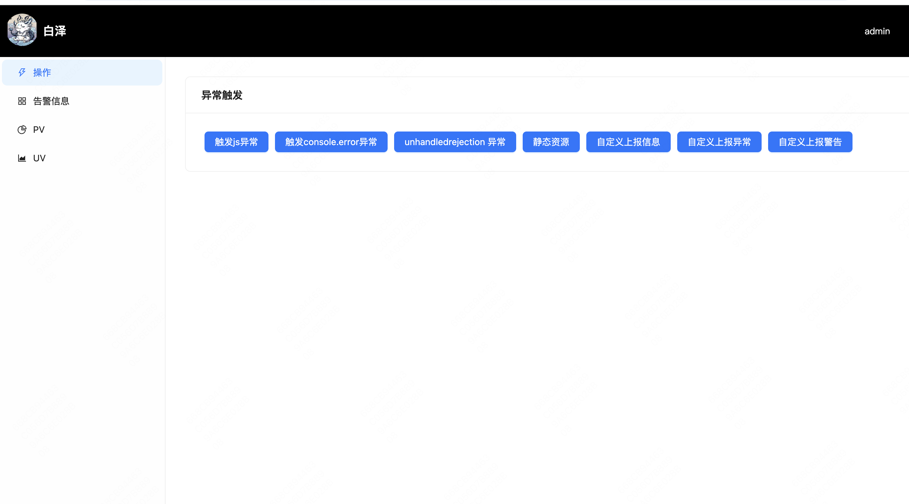
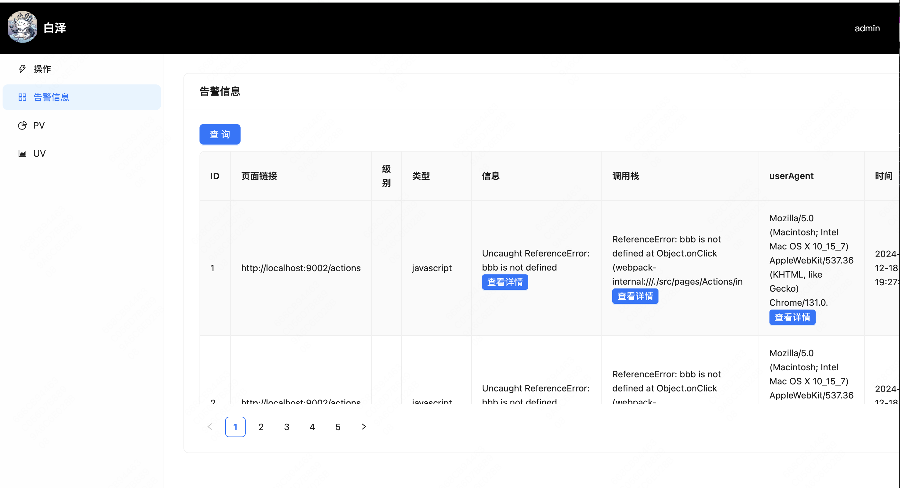
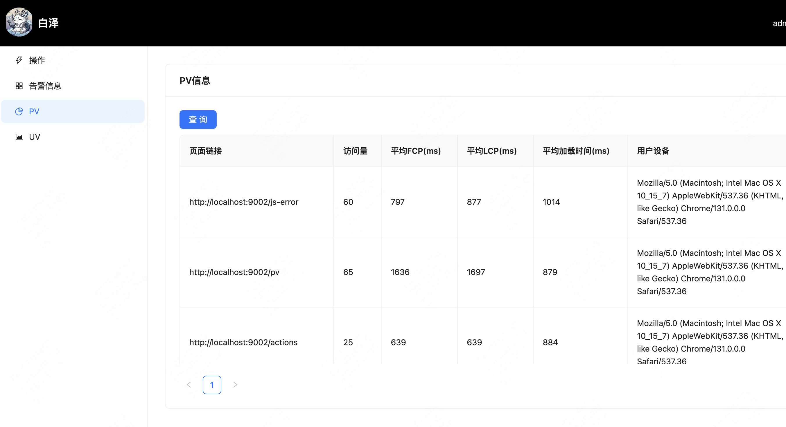
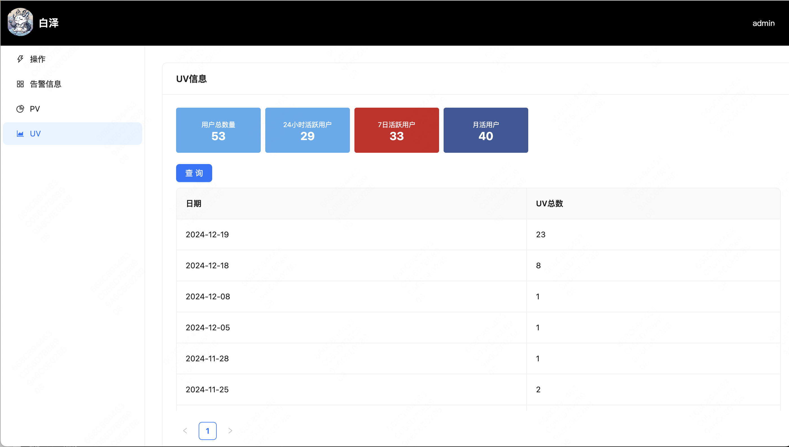

# 白泽

一体化前端监控平台

### 目录介绍

1. client 

前端示例代码，需要node14环境,包括登陆验证，用户注册，列表查询等

包括异常上报，PV，UV

2. server

包括登陆验证，用户注册，列表查询等，redis缓存，mysql数据库，JWT Token等 需要node16以上的环境

3. sdk 
 
 前端监控sdk 

4. mysql redis 应用docker

如果想项目跑起来，需要先启动docker内的mysql和redis ，默认端口即可 之后在mysql内创建monitor表

1、 docker ps

2、docker exec -it my-mysql mysql -uroot -proot

3、创建表monitor 

CREATE DATABASE IF NOT EXISTS monitor;

docker 客户端下载 https://www.docker.com/

###  操作

## 告警信息

### PV

### UV

